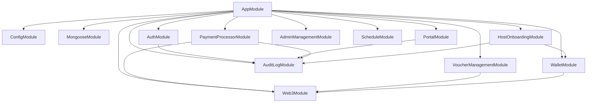

# Zaanet Server - Technical Documentation

## Table of Contents

1. [Project Overview](#project-overview)
2. [Architecture](#architecture)
3. [Module Documentation](#module-documentation)
4. [API Reference](#api-reference)
5. [Authentication & Authorization](#authentication--authorization)
6. [Database Models](#database-models)
7. [Blockchain Integration](#blockchain-integration)
8. [Security](#security)
9. [Payment Processing](#payment-processing)
10. [Environment Variables](#environment-variables)
11. [Development Setup](#development-setup)
12. [Deployment](#deployment)
13. [Troubleshooting](#troubleshooting)

---

## Project Overview

Zaanet is a decentralized WiFi voucher payment platform built on Arbitrum. The server is a NestJS application that:

- Manages user, host, and admin authentication
- Handles voucher creation, validation, and redemption
- Processes payments via Paystack (fiat) and blockchain (USDT)
- Integrates with smart contracts for payment processing
- Provides real-time session management for WiFi access
- Tracks all system actions via audit logging

### Tech Stack

| Layer          | Technology                    |
| -------------- | ----------------------------- |
| Framework      | NestJS 10+                    |
| Database       | MongoDB with Mongoose         |
| Authentication | JWT (Access + Refresh tokens) |
| Blockchain     | Ethers.js v6                  |
| Payments       | Paystack, USDT (ERC-20)       |
| API Docs       | OpenAPI/Swagger               |

---

## Architecture

### High-Level Architecture

```
┌─────────────────────────────────────────────────────────────────────┐
│                         Frontend Clients                            │
│   (Web App, Mobile App, WiFi Splash Page, Host Dashboard)         │
└─────────────────────────────────────────────────────────────────────┘
                                    │
                                    ▼
┌─────────────────────────────────────────────────────────────────────┐
│                     NestJS Application                               │
│  ┌──────────────┐  ┌──────────────┐  ┌──────────────┐           │
│  │   Auth       │  │   Portal    │  │  Web3        │           │
│  │   Module     │  │   Module    │  │  Module      │           │
│  └──────────────┘  └──────────────┘  └──────────────┘           │
│  ┌──────────────┐  ┌──────────────┐  ┌──────────────┐           │
│  │   Payment    │  │   Voucher   │  │   Wallet     │           │
│  │   Processor │  │   Management│  │   Module     │           │
│  └──────────────┘  └──────────────┘  └──────────────┘           │
└─────────────────────────────────────────────────────────────────────┘
                                    │
              ┌─────────────────────┼─────────────────────┐
              ▼                     ▼                     ▼
     ┌──────────────┐      ┌──────────────┐      ┌──────────────┐
     │   MongoDB    │      │  Arbitrum    │      │   Paystack   │
     │  Database    │      │  Blockchain  │      │   Gateway    │
     └──────────────┘      └──────────────┘      └──────────────┘
```

### Module Dependency Graph



---

## Module Documentation

### 1. AuthModule

**Purpose**: JWT-based authentication for all user types.

**Components**:

- `user-access/` - Portal user authentication
- `host-access/` - WiFi host authentication
- `admin-access/` - Platform admin authentication

**Key Files**:

```
src/auth/
├── auth.module.ts              # Auth module definition
├── auth.service.ts             # Core auth logic
├── constants/
│   ├── user-role.ts          # Role definitions
│   └── jwt.constants.ts      # JWT config
├── guards/
│   ├── jwt-auth.guard.ts    # JWT verification
│   ├── jwt-admin.guard.ts   # Admin-only guard
│   ├── roles.guard.ts       # Role-based access
│   └── host.guard.ts        # Host-only guard
├── strategies/
│   ├── jwt-user.strategy.ts # User JWT strategy
│   ├── jwt-host.strategy.ts # Host JWT strategy
│   └── jwt-admin.strategy.ts# Admin JWT strategy
├── decorators/
│   ├── roles.decorator.ts   # @Roles() decorator
│   └── current-user.decorator.ts
├── user-access/
│   ├── user-access.module.ts
│   ├── user-access.controller.ts
│   └── user-access.service.ts
├── host-access/
│   ├── host-access.module.ts
│   ├── host-access.controller.ts
│   └── host-access.service.ts
└── admin-access/
    ├── admin-access.module.ts
    ├── admin-access.controller.ts
    └── admin-access.service.ts
```

**Security Features**:

- Access tokens: 15-minute expiry
- Refresh tokens: 7-day expiry, stored in database
- Password hashing: bcrypt with 12 rounds
- Password strength validation (12+ chars, mixed case, numbers, special chars)

---

### 2. PortalModule

**Purpose**: Core user-facing APIs for network access and sessions.

**Components**:

- `sessions/` - WiFi session management
- `network/` - Network discovery and ratings
- `voucher/` - User voucher management
- `metrics/` - Usage analytics

**Key Endpoints**:

```
POST /api/v1/portal/sessions/start     # Start WiFi session with voucher
GET  /api/v1/portal/sessions/info    # Get session info
POST /api/v1/portal/sessions/confirm # Confirm network access
POST /api/v1/portal/sessions/end     # End session

GET  /api/v1/portal/networks         # List public networks
GET  /api/v1/portal/networks/:id    # Network details
POST /api/v1/portal/networks/:id/rate # Rate a network

GET  /api/v1/portal/vouchers         # User's vouchers
POST /api/v1/portal/vouchers/validate # Validate voucher
POST /api/v1/portal/vouchers/cancel  # Cancel unused voucher
```

---

### 3. Web3Module

**Purpose**: Read-only blockchain contract interactions.

**Smart Contracts**:
| Contract | Address | Purpose |
|----------|---------|---------|
| ZaaNetAdmin | `zaanetAdmin_CA` | Platform settings, fees |
| ZaaNetPayment | `zaanetPayment_CA` | Payment processing |
| ZaaNetNetwork | `zaanetNetwork_CA` | Network registration |
| ZaaNetStorage | `zaanetStorage_CA` | Data storage |
| USDT | `usdt_CA` | Payment token |

**Key Endpoints** (All Read-Only):

```
GET /api/v1/web3/contract-data        # Admin contract settings
GET /api/v1/web3/zaanet-transactions # Platform revenue data
GET /api/v1/web3/wallet-balances      # Treasury wallet balance
GET /api/v1/web3/contract-balance   # Payment contract USDT balance
GET /api/v1/web3/daily-limit         # Withdrawal limits
GET /api/v1/web3/transactions        # On-chain events
GET /api/v1/web3/contract-stats     # Aggregated statistics
```

> **Note**: Admin mutations (fee updates, address changes) are performed via Gnosis Safe multisig, not through the API.

---

### 4. PaymentProcessorModule

**Purpose**: Processes voucher payments on-chain.

**Key Features**:

- Batch payment processing via scheduler
- Automatic retry logic (max 3 attempts)
- Revenue sharing sync
- Balance checks before processing

**Scheduler** (`@Cron(CronExpression.EVERY_5_MINUTES)`):

```
processUsedUnpaidVouchers()
├── 1. Fetch pending/failed vouchers (limit 50)
├── 2. Check contract balance
├── 3. Mark as "processing"
├── 4. Call blockchain processBatchPayments()
├── 5. Update status to "completed"
└── 6. Sync revenue events
```

**Atomicity Pattern**:

```typescript
// Blockchain first (irreversible), then DB
await treasuryService.processBatchBlockPayments(vouchers);
await session.withTransaction(async () => {
  await voucherModel.updateMany({ status: 'completed' });
});
```

---

### 5. VoucherManagementModule

**Purpose**: Voucher lifecycle management.

**Voucher Types**:
| Source | Payment | Description |
|--------|---------|-------------|
| `paystack` | Yes | Purchased via mobile money |
| `crypto` | Yes | Purchased via crypto |
| `host` | Yes | Host-provided (paid by host) |
| `admin` | No | Free admin vouchers |

**Flow**:

```
Purchase (Paystack/Crypto)
    │
    ▼
Webhook Handler
    │
    ├── charge.success → Generate vouchers
    ├── charge.failed → Mark failed
    └── pending      → Wait for approval
```

**Key Endpoints**:

```
POST /api/v1/vouchers/charge          # Initiate mobile money payment
POST /api/v1/vouchers/submit-otp    # Submit OTP
GET  /api/v1/vouchers/verify/:ref   # Verify transaction
POST /api/v1/vouchers/host/register # Register host vouchers (on-chain)
POST /api/v1/vouchers/webhook       # Paystack webhook handler
```

---

### 6. WalletModule

**Purpose**: Host/user wallet management.

**Features**:

- Encrypted private key storage
- Wallet creation/destruction
- ETH/USDT balance fetching
- Gas top-up via relayer

**Key Endpoints**:

```
POST /api/v1/wallet/host/create      # Create host wallet
GET  /api/v1/wallet/host/:id         # Get host wallet info
GET  /api/v1/wallet/host/:id/balance # Host wallet balance

POST /api/v1/wallet/user/create      # Create user wallet
GET  /api/v1/wallet/user/:id         # Get user wallet info
POST /api/v1/wallet/user/transfer   # Transfer funds
```

---

### 7. HostOnboardingModule

**Purpose**: New host registration and network setup.

**Flow**:

```
Host Registration
    │
    ├── Validate email availability
    ├── Create wallet (encrypted)
    ├── Create host document
    ├── Create network document
    └── Store wallet address
    │
    ▼
Network Confirmation
    │
    ├── Host pays hosting fee (USDT)
    ├── Register on ZaaNetNetwork contract
    ├── Update contractId in DB
    └── Network goes live
```

**Key Endpoints**:

```
POST /api/v1/hosts/register      # Register new host + network
GET  /api/v1/hosts/:address     # Check if host exists
POST /api/v1/hosts/confirm     # Confirm network on blockchain
```

---

### 8. AdminManagementModule

**Purpose**: Platform administration.

**Key Endpoints**:

```
# Dashboard
GET  /api/v1/admin/dashboard/comprehensive  # All stats
GET  /api/v1/admin/dashboard/clients        # Client stats
GET  /api/v1/admin/dashboard/networks      # Network stats

# Host Management
GET  /api/v1/admin/hosts                  # List hosts
PATCH /api/v1/admin/hosts/:id           # Update host
DELETE /api/v1/admin/hosts/:id          # Delete host
POST /api/v1/admin/hosts/:id/verify     # Verify host

# Network Management
GET  /api/v1/admin/networks              # All networks
PATCH /api/v1/admin/networks/:id        # Update network
DELETE /api/v1/admin/networks/:id       # Delete network

# System
GET  /api/v1/admin/metrics              # System metrics
POST /api/v1/admin/bootstrap            # Bootstrap super admin
```

---

### 9. AuditLogModule

**Purpose**: Comprehensive action tracking for compliance and debugging.

**Tracked Actions**:

- Authentication (login, logout, registration)
- Voucher operations (creation, redemption, cancellation)
- Session operations (start, end, pause)
- Payment processing (attempts, successes, failures)
- Admin actions (updates, deletions)
- Blockchain transactions

**Storage**: MongoDB collection `auditlogs`

**Query Endpoints**:

```
GET /api/v1/audit-logs           # Query audit logs
GET /api/v1/audit-logs/export   # Export logs
```

---

### 10. RelayerModule

**Purpose**: Ensures hosts/users have ETH for gas.

**How It Works**:

```
User initiates transaction (e.g., transfer USDT)
    │
    ├── Check wallet ETH balance
    ├── If < threshold:
    │   └── Relayer sends ETH from gas tank
    └── Proceed with transaction
```

> See `src/relayer/README.md` for detailed documentation

---

## API Reference

### Base URL

```
Production: https://api.zaanet.xyz/v1
Development: http://localhost:3005/api/v1
```

### Authentication

All protected endpoints require:

```
Authorization: Bearer <access_token>
```

### Response Format

**Success**:

```json
{
  "success": true,
  "data": { ... }
}
```

**Error**:

```json
{
  "statusCode": 400,
  "message": "Error description",
  "error": "Bad Request"
}
```

### Public Endpoints

| Method | Endpoint                 | Description           |
| ------ | ------------------------ | --------------------- |
| POST   | `/auth/login`            | User/host/admin login |
| POST   | `/auth/register`         | Register new user     |
| GET    | `/portal/networks`       | List public networks  |
| GET    | `/portal/networks/:id`   | Network details       |
| POST   | `/portal/sessions/start` | Start WiFi session    |
| GET    | `/vouchers/verify/:ref`  | Verify payment        |

### Protected Endpoints

Protected endpoints require JWT authentication. Add header:

```
Authorization: Bearer <access_token>
```

### User Endpoints

| Method | Endpoint               | Description          |
| ------ | ---------------------- | -------------------- |
| GET    | `/users/current-user`  | Get current user     |
| GET    | `/users/:address/role` | Check user role      |
| POST   | `/users/refresh`       | Refresh access token |
| POST   | `/users/logout`        | Logout               |

### Host Endpoints

| Method | Endpoint                    | Description      |
| ------ | --------------------------- | ---------------- |
| POST   | `/hosts/register`           | Register host    |
| GET    | `/hosts/:address`           | Get host info    |
| PATCH  | `/hosts/profile`            | Update profile   |
| GET    | `/hosts/networks`           | List my networks |
| POST   | `/hosts/networks`           | Add network      |
| POST   | `/hosts/networks/:id/price` | Update price     |

### Admin Endpoints

| Method | Endpoint           | Description           |
| ------ | ------------------ | --------------------- |
| GET    | `/admin/dashboard` | Dashboard data        |
| GET    | `/admin/hosts`     | List all hosts        |
| PATCH  | `/admin/hosts/:id` | Update host           |
| DELETE | `/admin/hosts/:id` | Delete host           |
| GET    | `/admin/networks`  | List all networks     |
| POST   | `/admin/bootstrap` | Bootstrap super admin |

---

## Authentication & Authorization

### User Roles

```typescript
enum UserRole {
  USER = 'user', // Regular customer
  HOST = 'host', // WiFi provider
  ADMIN = 'admin', // Platform admin
  SUPER_ADMIN = 'super_admin',
}
```

### JWT Strategy

**Access Token**:

- Payload: `{ sub: userId, email: string, role: string }`
- Expiry: 15 minutes
- Algorithm: HS256

**Refresh Token**:

- Stored in MongoDB (`refreshtokens` collection)
- Expiry: 7 days
- Rotation: New refresh token on each use

### Guards

| Guard              | Purpose                  |
| ------------------ | ------------------------ |
| `@JwtAuthGuard()`  | Validates JWT token      |
| `@JwtAdminGuard()` | Requires admin role      |
| `@Roles('host')`   | Requires host role       |
| `@HostGuard()`     | Host-specific validation |

### Password Security

- **Hashing**: bcrypt with 12 rounds
- **Validation**:
  - Minimum 12 characters
  - At least one: uppercase, lowercase, number, special char
  - No common patterns (password123, qwerty, etc.)

---

## Database Models

### Users Collection

```typescript
{
  _id: ObjectId,
  email: string,
  name: string,
  passwordHash: string,
  role: 'user',
  isActive: boolean,
  verification: {
    isVerified: boolean,
    verifiedAt?: Date
  },
  createdAt: Date,
  updatedAt: Date
}
```

### Hosts Collection

```typescript
{
  _id: ObjectId,
  email: string,
  hostAddress: string,        // Wallet address
  hostName: string,
  passwordHash: string,
  isActive: boolean,
  totalEarnings: number,
  stats: {
    totalNetworks: number,
    activeNetworks: number,
    totalSessions: number,
    totalRevenue: number
  },
  contactInfo: {
    phone: string,
    telegram: string
  },
  networkIds: ObjectId[],
  verification: {
    isVerified: boolean,
    verifiedAt?: Date
  },
  createdAt: Date
}
```

### Networks Collection

```typescript
{
  _id: ObjectId,
  contractId: string,         // On-chain ID
  ssid: string,
  host: ObjectId,            // Ref to Host
  pricePerSession: number,    // USDT
  localPrice: {
    currency: string,
    country: string,
    amountPerSession: number
  },
  status: 'active' | 'offline' | 'maintenance',
  approved: boolean,
  location: {
    country: string,
    region: string,
    city: string,
    area: string,
    coordinates: {
      latitude: number,
      longitude: number
    }
  },
  hardware: {
    deviceType: string,
    specifications: object
  },
  ratingCount: number,
  totalRating: number,
  successfulSessions: number,
  createdAt: Date
}
```

### Vouchers Collection

```typescript
{
  _id: ObjectId,
  code: string,               // 8-char alphanumeric
  status: 'active' | 'used' | 'expired' | 'cancelled',
  usdEquivalent: number,
  localAmount: number,
  currency: string,
  source: 'paystack' | 'crypto' | 'host' | 'admin',
  paymentStatus: 'pending' | 'processing' | 'completed' | 'failed' | 'not_required',
  paymentRetries: number,
  paymentProcessedAt?: Date,
  txHash?: string,
  hostPaid: boolean,
  sessionHours?: number,      // For host vouchers
  contractId?: string,        // Restrict to network
  restrictToHostId?: ObjectId,
  redeemedAt?: Date,
  redeemedBy?: string,
  expiresAt?: Date,
  usageHistory: [{
    action: string,
    timestamp: Date,
    macAddress?: string
  }],
  createdAt: Date
}
```

### UserSessions Collection

```typescript
{
  _id: ObjectId,
  sessionId: string,          // s{contractId}_{random}
  contractId: string,
  routerId: string,
  macAddress: string,
  status: 'active' | 'paused' | 'expired',
  active: boolean,
  duration: number,          // Hours
  remainingTimeSecs: number,
  startTime: Date,
  lastSeen: Date,
  dataUsage: {
    downloadBytes: number,
    uploadBytes: number,
    totalBytes: number
  },
  createdAt: Date,
  updatedAt: Date
}
```

### AuditLogs Collection

```typescript
{
  _id: ObjectId,
  action: string,             // Action type
  actor: string,             // User/host/system
  contractId?: string,
  metadata?: object,        // Additional context
  timestamp: Date
}
```

---

## Blockchain Integration

### Network Configuration

```typescript
const ARBITRUM_SEPOLIA = {
  name: 'arbitrum-sepolia',
  chainId: 421614,
  rpc: process.env.ARBITRUM_SEPOLIA_RPC_URL,
  explorer: 'https://sepolia.arbiscan.io',
};
```

### Contract Interactions

**All Read Operations** (no signer required):

- `getAdminContractData()` - Platform fees, addresses
- `getContractBalance()` - USDT balance
- `getDailyLimit()` - Withdrawal limits
- `getTransactions()` - Event logs

**Write Operations** (via multisig):

- Fee updates
- Address changes
- Contract upgrades

### Payment Flow

```
User redeems voucher
    │
    ▼
Session Service
    │
    ├── Validates voucher
    ├── Creates session
    └── Marks voucher "used"
    │
    ▼
Payment Processor (Scheduler)
    │
    ├── Fetches "used" unpaid vouchers
    ├── Checks contract balance
    ├── Calls processBatchPayments()
    └── Updates voucher status
    │
    ▼
Blockchain Contract
    │
    ├── Deducts USDT from treasury
    ├── Calculates fees (platform + host)
    ├── Transfers to host
    └── Emits PaymentProcessed event
    │
    ▼
Event Sync
    │
    └── Updates revenue sharing in DB
```

---

## Security

### Implemented Security Measures

| Feature          | Implementation                                     |
| ---------------- | -------------------------------------------------- |
| Helmet           | CSP, X-Frame-Options, hidePoweredBy                |
| CORS             | Allowed origins list, blocked null origins in prod |
| Rate Limiting    | 100 requests/minute via @nestjs/throttler          |
| Request Size     | 10KB max body size                                 |
| Input Validation | class-validator DTOs                               |
| Password Hashing | bcrypt 12 rounds                                   |
| JWT              | Short-lived access tokens                          |
| MongoDB SSL      | TLS/SSL connection                                 |
| Session IDs      | 32-char cryptographically secure                   |

### Security Headers

```typescript
app.use(
  helmet({
    contentSecurityPolicy: {
      directives: {
        defaultSrc: ["'self'"],
        styleSrc: ["'self'", "'unsafe-inline'"],
        imgSrc: ["'self'", 'data:', 'https:'],
        scriptSrc: ["'self'"],
        frameAncestors: ["'none'"],
      },
    },
    hidePoweredBy: true,
  }),
);
```

---

## Payment Processing

### Payment Methods

| Method               | Gateway  | Status    |
| -------------------- | -------- | --------- |
| Mobile Money (Ghana) | Paystack | ✅ Active |
| Crypto (USDT)        | Direct   | ✅ Active |
| Host Vouchers        | On-chain | ✅ Active |

### Paystack Integration

**Flow**:

1. Customer initiates payment → `POST /vouchers/charge`
2. Paystack sends OTP to phone
3. Customer submits OTP → `POST /vouchers/submit-otp`
4. Paystack processes payment
5. Webhook notifies success/failure
6. System generates vouchers

**Supported Currencies**: GHS (Cedis)

### Crypto Integration

**Supported Tokens**: USDT (ERC-20)

**Flow**:

1. User sends USDT to contract
2. System detects payment
3. Vouchers generated automatically

---

## Environment Variables

### Required Variables

```bash
# MongoDB
MONGODB_URI=mongodb+srv://...

# JWT
JWT_SECRET=<64-char-hex>
REFRESH_TOKEN_SECRET=<64-char-hex>

# Blockchain
ARBITRUM_SEPOLIA_RPC_URL=https://...
TREASURY_WALLET_ADDRESS=0x...
TREASURY_PRIVATE_KEY=0x...
PAYMENT_CONTRACT_ADDRESS=0x...
ADMIN_CONTRACT_ADDRESS=0x...

# Payment
PAYSTACK_LIVE_SECRET_KEY=sk_live_...
PAYSTACK_PUBLIC_KEY=pk_live_...

# App
NODE_ENV=development
FRONTEND_URL=http://localhost:3000
```

### Optional Variables

```bash
# Email (SendGrid/SMTP)
EMAIL_API_KEY=...
EMAIL_FROM=noreply@zaanet.xyz

# Cloud Storage
CLOUDINARY_API_KEY=...
CLOUDINARY_API_SECRET=...
CLOUDINARY_CLOUD_NAME=...

# Alchemy (backup RPC)
ALCHEMY_API_KEY=...
```

---

## Development Setup

### Prerequisites

- Node.js 20+
- MongoDB (local or Atlas)
- npm or pnpm

### Installation

```bash
# Clone and install
git clone https://github.com/zaanet/server.git
cd server
npm install

# Create environment file
cp .env.example .env
# Edit .env with your values

# Build
npm run build

# Start development
npm run start:dev

# Or run production
npm run start:prod
```

### Available Scripts

```bash
npm run build           # Build for production
npm run start:dev      # Development server
npm run start:prod    # Production server
npm run lint          # Lint code
npm run test          # Run tests
```

---

## Deployment

### Production Checklist

- [ ] Set `NODE_ENV=production`
- [ ] Configure allowed origins
- [ ] Enable MongoDB SSL
- [ ] Set strong JWT secrets
- [ ] Configure rate limiting
- [ ] Set up monitoring/logging
- [ ] Configure health check endpoint

### Docker (Optional)

```dockerfile
FROM node:20-alpine
WORKDIR /app
COPY package*.json ./
RUN npm ci --only=production
COPY dist ./dist
COPY .env .env
EXPOSE 3005
CMD ["node", "dist/main.js"]
```

### Health Checks

```bash
GET /health    # Basic health
GET /ready     # Readiness probe
```

---

## Troubleshooting

### Common Issues

**MongoDB Connection Error**

```
MongoParseError: option sslvalidate is not supported
```

→ Use `ssl: true` (not `sslValidate`)

**JWT Token Expired**
→ Use refresh token endpoint to get new access token

**Payment Processing Failed**
→ Check:

- Contract balance: `GET /web3/contract-balance`
- Network status: `GET /portal/networks/:id`
- Voucher status in database

**Voucher Redemption Failed**
→ Verify:

- Voucher is "active" status
- Not expired
- MAC not blocked
- Not already used

### Logs

Application logs are available via:

```bash
# Development - console output
npm run start:dev

# Production - check logs directory or container logs
docker logs -f <container-id>
```

---

## License

Proprietary - All rights reserved.

---

## Support

For technical support:

- Email: zaanetofficial@gmail.com
